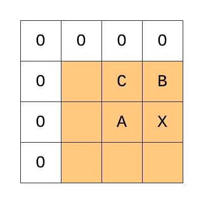
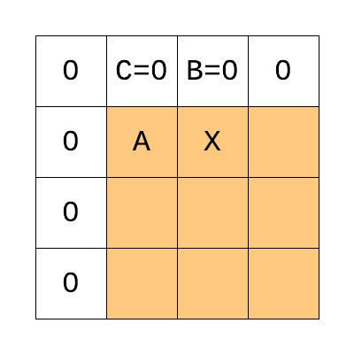

# Home_Pictures

## TODO
* [X] Experimental BMP Headers.
* [X] Experimental PNG Headers.
* [X] Experimental chunk reader.
* [ ] Find out how data should flow from compressed to uncompressed to reconstructed.
* [ ] Inflate uncompress PNG IDAT chunks. https://github.com/AdaHome/Home_zlib
* [ ] Deflate compress PNG IDAT chunks. https://github.com/AdaHome/Home_zlib
* [ ] Common picture type that can be used for decoding any supported picture.

* [X] Implement ability to detect courruption in a PNG stream. The PNG decoding checks if PNG stream is corrupted by using assertion. To avoid exception handling, check if PNG is non corrupted before decoding.

* [ ] Turning off CRC32 checks when assertion is turned off.
      There is no reason to calculate CRC32 if it is not evaluated.


## Filter Method 0




Pixel Position | Comment
------------ | -------------
`X` | The byte being filtered.
`A` | The byte corresponding to x in the pixel immediately before the pixel containing x (or the byte immediately before x, when the bit depth is less than 8.
`B` | The byte corresponding to x in the previous scanline.
`C` | The byte corresponding to b in the pixel immediately before the pixel containing b (or the byte immediately before b, when the bit depth is less than 8.

```Ada
function Reconstruction_Function (Filter_Type : PNG_Filter_Type; X, A, B, C : Unsigned_8) return Unsigned_8 is
begin
  case Filter_Type is
  when PNG_Filter_Type_None =>
	 return X;
  when PNG_Filter_Type_Sub =>
	 return X + B;
  when PNG_Filter_Type_Up =>
	 return X + A;
  when PNG_Filter_Type_Average =>
	 return X + ((A + B) / 2);
  when PNG_Filter_Type_Paeth =>
	 declare
		P, PA, PB, PC, PR : Unsigned_8;
	 begin
		P := A + B - C;
		PA := abs (P - A);
		PB := abs (P - B);
		PC := abs (P - C);
		if PA <= PB and PA <= PC then
		   PR := A;
		elsif PB <= PC then 
		   PR := B;
		else
		   PR := C;
		end if;
		return PR;
	 end;
  end case;
end;
```
